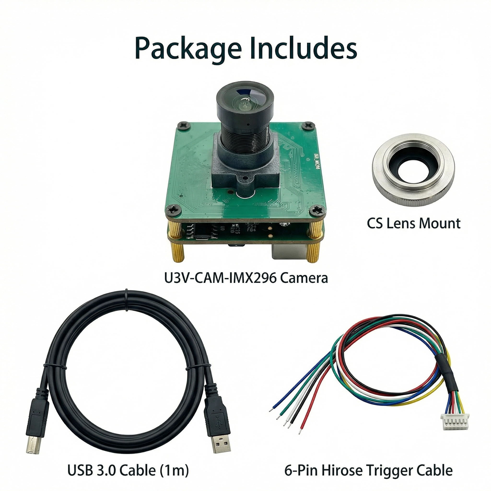

# U3V-CAM-IMX296 USB3 Vision Industrial Camera



The **U3V-CAM-IMX296** is a high-performance USB3 Vision industrial camera featuring the **Sony IMX296LLR** (monochrome) global shutter CMOS sensor. With a resolution of **1.58 MP (1456 × 1088)** and a full-resolution frame rate of **60 fps**, it provides reliable, distortion-free imaging for demanding machine-vision applications such as motion analysis, automation, robotics, and scientific imaging.

The camera is 100% compliant with **USB3 Vision v1.0** and **GenICam 3.x** standards, offering plug-and-play compatibility across all major software platforms including OpenSource Aravis and Pleora eBus Universal.

---

## Key Features

*   **Sony IMX296 Global Shutter Sensor**: 1/2.9" CMOS sensor with 3.45 µm pixels, ensuring zero rolling distortion.
*   **High Frame Rate**: Up to 60 fps at full resolution (1456 x 1088); exceeds 1900 fps with reduced ROI.
*   **True Analog Gain**: 0–48 dB range with 0.1 dB steps for extremely low-noise imaging.
*   **Long Exposure**: Supports manual shutter with true long-exposure capability (≥ 15 seconds).
*   **Precise Synchronization**: Opto-isolated hardware trigger (5–24V) and strobe output with 0.1 µs hardware timestamping.
*   **Industrial Design**: USB 3.0 bus-powered, compact form factor, and on-board temperature monitoring.
*   **Standard Compliance**: Fully compatible with any GenICam-compliant software without proprietary patches.

---

## Specifications

| Feature | Specification |
| :--- | :--- |
| **Sensor** | Sony IMX296LLR (Monochrome, Global Shutter) |
| **Resolution** | 1456 (H) × 1088 (V), 1.58 MP |
| **Pixel Size** | 3.45 µm × 3.45 µm |
| **Max Frame Rate** | 60 fps @ Full ROI (Mono8) |
| **Exposure Time** | 29 µs to ≥ 15 seconds |
| **Analog Gain** | 0 – 48 dB (0.1 dB steps) |
| **Interface** | USB 3.0 (Type-C or Micro-B depending on model) |
| **I/O Connector** | 6-pin Hirose (Trigger In, Strobe Out, GND) |
| **Power** | USB Bus-powered, 5V / ≤ 3.2W |
| **Lens Mount** | M12 (Default) / CS-Mount (Optional) |
| **Operating Temp** | -10 °C to +65 °C |

---

## Hardware Interface

### 6-pin Hirose Connector Pinout (HR10A-7R-6P)

| Pin | Signal | Description |
| :--- | :--- | :--- |
| 1 | GPIO_B33 | Reserved |
| 2 | Trig + | Opto-isolated Trigger Input (+) |
| 3 | GPIO_A33 | Reserved |
| 4 | STROBE + | Opto-isolated Strobe Output (+) |
| 5 | STROBE - / Trig - | Opto-isolated I/O Ground |
| 6 | GND | System Ground |

---

## Software & SDK

### 1. Standard USB3 Vision Software (eBus Player)

The camera works out-of-the-box with any U3V-compliant software. We recommend the latest **eBus Player** for the best experience. See the [Resource Downloads](#resource-downloads) section for download links.

### 2. U3V Camera SDK (C-based API)

For developers looking to integrate the camera into their own applications, we provide a lightweight C-based SDK with cross-platform support.

**Location**: [`InnoMaker_SDK_Libusb_Win_Linux/`](./InnoMaker_SDK_Libusb_Win_Linux/)

**Features**:
- Device discovery and enumeration
- Parameter control (Exposure, Gain, ROI, Trigger)
- High-speed image streaming
- Cross-platform: Windows (x64) and Linux (x64 / ARM64)

**Documentation**: See [`InnoMaker_SDK_Libusb_Win_Linux/DELIVERY_OVERVIEW.md`](./InnoMaker_SDK_Libusb_Win_Linux/DELIVERY_OVERVIEW.md) for detailed API usage, build instructions, and platform-specific deployment guides.

---

## Installation Guide

### Windows

1. **Extract SDK**: Download `V9-SDK-DLL-CUS.zip` from the [Resource Downloads](#resource-downloads) section and extract to any directory (e.g., `D:\u3v\`).

2. **Install WinUSB Driver**:
   - Plug in the U3V camera
   - Right-click `V9-SDK-DLL-CUS\tools\zadig-2.9.exe` and run as administrator
   - Follow the on-screen prompts to install the WinUSB driver on the Composite Parent device
   - See `V9-SDK-DLL-CUS\WINUSB_DRIVER_INSTALL.md` for detailed instructions

3. **Launch GUI Viewer**:
   - Double-click `V9-SDK-DLL-CUS\run_viewer.bat`
   - The GUI viewer should launch and display your camera in the device list

### Linux (including Raspberry Pi 5)

The camera is fully validated on Raspberry Pi 5 (Debian Bookworm/Trixie) and Ubuntu 22.04+ systems.

#### Option A: Use Preset Image (Recommended for Raspberry Pi 5)

For a quick setup, we provide a pre-configured OS image for Raspberry Pi 5 with all drivers and software pre-installed.

**Download**: See the [Resource Downloads](#resource-downloads) section for the preset image link.

**Flash to microSD card**:
```bash
# On your host machine (Linux/macOS/Windows with Balena Etcher or similar)
# 1. Download the preset image
# 2. Flash to microSD card using Balena Etcher or dd command
# 3. Insert microSD into Raspberry Pi 5 and boot
```

#### Option B: Manual Installation on Ubuntu / Debian

1. **Install Runtime Dependencies**:
   ```bash
   sudo apt update
   sudo apt install -y libusb-1.0-0 libqt6widgets6
   ```

2. **Extract and Deploy SDK**:
   ```bash
   tar xzf V9-SDK-SO-CUS.tar.gz
   cd V9-SDK-SO-CUS
   
   # For ARM64 (Raspberry Pi 5, Jetson, etc.)
   cd ubuntu22.04-arm64
   
   # For x86_64 (Intel/AMD)
   # cd ubuntu22.04-x64
   ```

3. **Install udev Rule** (allow non-root USB access):
   ```bash
   sudo tee /etc/udev/rules.d/99-u3v.rules > /dev/null <<'EOF'
   SUBSYSTEM=="usb", ATTRS{bDeviceClass}=="ef", ATTRS{bDeviceSubClass}=="02", ATTRS{bDeviceProtocol}=="01", MODE="0666", GROUP="plugdev"
   EOF
   
   sudo udevadm control --reload-rules && sudo udevadm trigger
   sudo usermod -aG plugdev $USER
   # Log out and back in for the group change to take effect
   ```

4. **Launch GUI Viewer**:
   ```bash
   ./run_viewer.sh
   ```

---

## Repository Structure

| Directory | Purpose |
| :--- | :--- |
| [`InnoMaker_SDK_Libusb_Win_Linux/`](./InnoMaker_SDK_Libusb_Win_Linux/) | C-based SDK with Windows (x64) and Linux (x64/ARM64) binaries, headers, examples, and build guides |
| [`eBusPlayer&Aravis_PI5_Linux/`](./eBusPlayer&Aravis_PI5_Linux/) | eBus Player and Aravis software packages for Raspberry Pi 5 and Linux systems |
| [`eBusPlayer_Win/`](./eBusPlayer_Win/) | Windows eBus Player SDK information and download links |
| [`PreInstalled-IMG-PI5/`](./PreInstalled-IMG-PI5/) | Download links for pre-configured Raspberry Pi 5 OS image with all software pre-installed |
| [`images/`](./images/) | Product images and marketing materials |
| [`U3V-CAM-IMX296 User Manual V10.pdf`](./U3V-CAM-IMX296%20User%20Manual%20V10.pdf) | Comprehensive technical documentation covering hardware, software, and troubleshooting |

---

## Quick Start Examples

### Windows: Run the GUI Viewer

```batch
cd V9-SDK-DLL-CUS
run_viewer.bat
```

### Linux: Compile and Run a Custom Application

```bash
cd V9-SDK-SO-CUS/ubuntu22.04-arm64

# Compile your application
gcc my_app.c \
    -I./include \
    -L./lib -lu3v_cam \
    -Wl,-rpath,'$ORIGIN/lib' \
    -o my_app

# Run it
./my_app
```

---

## Support

For more information and technical support, please visit:

*   **Website**: [www.inno-maker.com](https://www.inno-maker.com)
*   **GitHub**: [github.com/INNO-MAKER](https://github.com/INNO-MAKER)
*   **Email**: [support@inno-maker.com](mailto:support@inno-maker.com) | [sales@inno-maker.com](mailto:sales@inno-maker.com)

---

## Resource Downloads

### SDK & Preset Image for Raspberry Pi 5

**Download Link**: [U3V Camera SDK (Windows & Linux) + Preset Image for Raspberry Pi 5](https://www.jianguoyun.com/p/DXuEVqMQpdSrBxiqmp0GIAA)

**Password**: `uwpui3`

**Contents**:
- `V9-SDK-DLL-CUS.zip` — Windows SDK (x64)
- `V9-SDK-SO-CUS.tar.gz` — Linux SDK (x64 / ARM64)
- Preset OS image for Raspberry Pi 5 (ready to flash)

### eBus Player Official Latest Software

*   **For Windows**: [Download eBus Player for Windows](https://www.jai.com/support-software/jetson-ubuntu)
*   **For Linux**: [Download eBus Player for Linux](https://www.jai.com/support-software/jetson-ubuntu)

---

## Technical Documentation

For detailed API reference, build environment setup, driver installation, and troubleshooting:

- **SDK Overview & API**: See `InnoMaker_SDK_Libusb_Win_Linux/DELIVERY_OVERVIEW.md`
- **Hardware & Software Manual**: See `U3V-CAM-IMX296 User Manual V10.pdf`
- **eBus Player Guides**: See `eBusPlayer&Aravis_PI5_Linux/ebus_for_raspberry_pi5/` for quick start guides and API documentation
