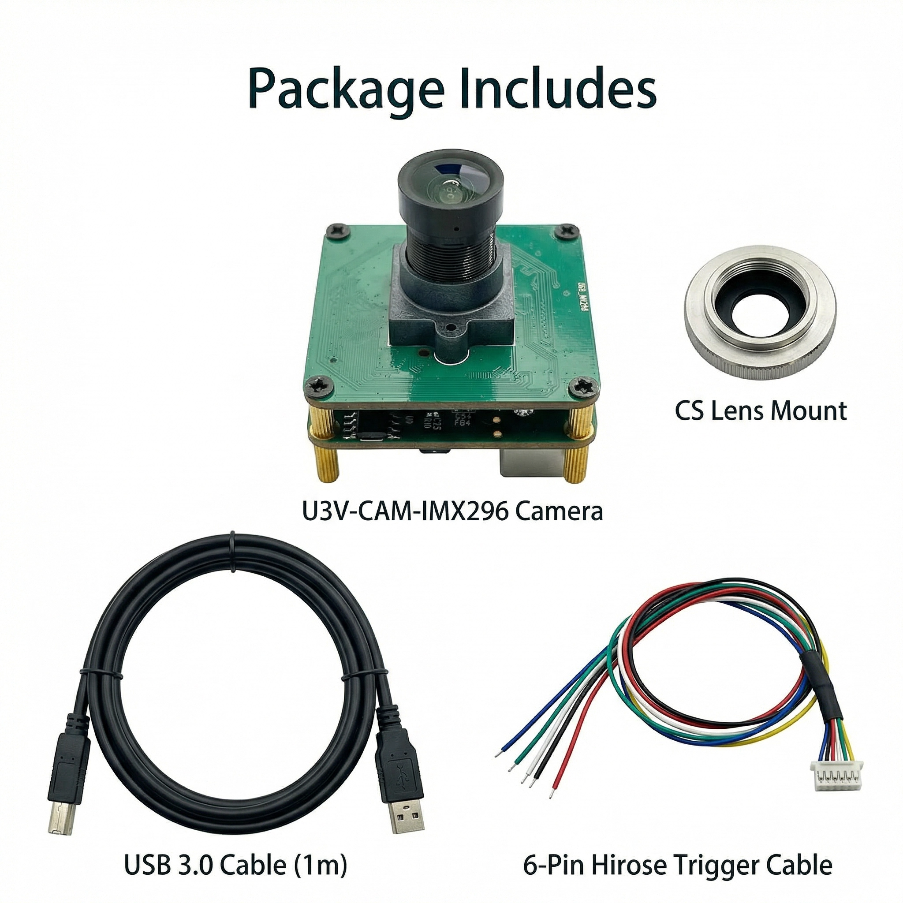

# U3V-CAM-IMX296 USB3 Vision Industrial Camera



The **U3V-CAM-IMX296** is a high-performance USB3 Vision industrial camera featuring the **Sony IMX296LLR** (monochrome) global shutter CMOS sensor. With a resolution of **1.58 MP (1456 × 1088)** and a full-resolution frame rate of **60 fps**, it provides reliable, distortion-free imaging for demanding machine-vision applications such as motion analysis, automation, robotics, and scientific imaging.

The camera is 100% compliant with **USB3 Vision v1.0** and **GenICam 3.x** standards, offering plug-and-play compatibility across all major software platforms.

---

## Key Features

*   **Sony IMX296 Global Shutter Sensor**: 1/2.9" CMOS sensor with 3.45 µm pixels, ensuring zero rolling distortion.
*   **High Frame Rate**: Up to 60 fps at full resolution (1456 × 1088); exceeds 1900 fps with reduced ROI.
*   **True Analog Gain**: 0–48 dB range with 0.1 dB steps for extremely low-noise imaging.
*   **Long Exposure**: Supports manual shutter with true long-exposure capability (≥ 15 seconds).
*   **Precise Synchronization**: Opto-isolated hardware trigger (5–24V) and strobe output with 0.1 µs hardware timestamping.
*   **Industrial Design**: USB 3.0 bus-powered, compact form factor, and on-board temperature monitoring.
*   **Standard Compliance**: Fully compatible with any GenICam-compliant software without proprietary patches.

---

## Specifications

| Feature | Specification |
| :--- | :--- |
| **Sensor** | Sony IMX296LLR (Monochrome, Global Shutter) |
| **Resolution** | 1456 (H) × 1088 (V), 1.58 MP |
| **Pixel Size** | 3.45 µm × 3.45 µm |
| **Max Frame Rate** | 60 fps @ Full ROI (Mono8) |
| **Exposure Time** | 29 µs to ≥ 15 seconds |
| **Analog Gain** | 0 – 48 dB (0.1 dB steps) |
| **Interface** | USB 3.0 (Type-C or Micro-B depending on model) |
| **I/O Connector** | 6-pin Hirose (Trigger In, Strobe Out, GND) |
| **Power** | USB Bus-powered, 5V / ≤ 3.2W |
| **Lens Mount** | M12 (Default) / CS-Mount (Optional) |
| **Operating Temp** | -10 °C to +65 °C |

---

## 1. Hardware

### 6-pin Hirose Connector Pinout (HR10A-7R-6P)

| Pin | Signal | Description |
| :--- | :--- | :--- |
| 1 | GPIO_B33 | Reserved |
| 2 | Trig + | Opto-isolated Trigger Input (+) |
| 3 | GPIO_A33 | Reserved |
| 4 | STROBE + | Opto-isolated Strobe Output (+) |
| 5 | STROBE - / Trig - | Opto-isolated I/O Ground |
| 6 | GND | System Ground |

For detailed hardware dimensions, connector parameters, and wiring diagrams, refer to the [U3V-CAM-IMX296 User Manual V10.pdf](./U3V-CAM-IMX296%20User%20Manual%20V10.pdf).

---

## 2. InnoMaker SDK

The **InnoMaker U3V SDK** (version 2.1.1) is the recommended choice for developers who need direct, low-level camera access and maximum performance. It provides a lightweight, cross-platform C/C++ API and a Python binding, all built on the same underlying shared library.

**SDK version**: 2.1.1 — **Last updated**: 2026-06-01

For full delivery notes and package contents, see [`InnoMaker_SDK_Libusb_Win_Linux/DELIVERY_OVERVIEW.md`](./InnoMaker_SDK_Libusb_Win_Linux/DELIVERY_OVERVIEW.md).

### Available Packages

| Package | Platform | Size | Description |
| :--- | :--- | :--- | :--- |
| `V9-SDK-DLL-CUS.zip` | Windows x64 | 26 MB (zip) / 56 MB | C/C++ SDK with GUI viewer, CLI demo, headers, and bundled runtime |
| `V9-SDK-SO-CUS.tar.gz` | Linux x64 / ARM64 | 520 KB (tar.gz) / 1.4 MB | C/C++ SDK with GUI viewer, CLI demo, and headers |
| `V9-SDK-PYTHON-CUS.zip` | Windows + Linux x64 / ARM64 | 540 KB (zip) / 1.2 MB | Python SDK — bundles native libraries for all platforms |
| `V9-SDK-DYLIB-CUS.zip` | macOS arm64 + x86_64 | 42 MB | macOS C/C++ SDK with GUI viewer — one per-arch zip inside (Apple Silicon + Intel) |

All four packages share the same SDK source tree and the same underlying shared library. The Python package wraps the identical C library via ctypes — no separate codepath.

### Supported Platforms

| Platform | Architecture | Status |
| :--- | :--- | :--- |
| Windows 10 / 11 | x64 | ✅ Fully Supported |
| Ubuntu 22.04+ / Debian 12+ | x64 | ✅ Fully Supported |
| Raspberry Pi 5 (Bookworm / Trixie) | ARM64 | ✅ Fully Supported |
| NVIDIA Jetson Orin Nano (JetPack 6.0+) | ARM64 | ✅ Fully Supported |
| macOS 11+ (Apple Silicon M1/M2/M3/M4) | arm64 | ✅ Fully Supported |
| macOS 11+ (Intel Mac) | x86_64 | ✅ Fully Supported |

### Windows Installation (C/C++)

1. Extract `V9-SDK-DLL-CUS.zip` to any directory (e.g., `D:\u3v\`)
2. Plug in the U3V camera
3. Right-click `V9-SDK-DLL-CUS\tools\zadig-2.9.exe` → **Run as administrator** → install the WinUSB driver (see `WINUSB_DRIVER_INSTALL.md`)
4. Double-click `run_viewer.bat` to launch the GUI viewer

For application development, add `include\` to your include path, `lib\u3v_cam.lib` to your linker, and ensure `bin\` is on PATH at runtime.

### Linux Installation (C/C++)

```bash
tar xzf V9-SDK-SO-CUS.tar.gz
cd V9-SDK-SO-CUS

# Install runtime dependencies (one-time)
sudo apt update && sudo apt install -y libusb-1.0-0 libqt6widgets6

# Install udev rule for non-root USB access (one-time)
sudo tee /etc/udev/rules.d/99-u3v.rules > /dev/null <<'EOF'
SUBSYSTEM=="usb", ATTRS{bDeviceClass}=="ef", ATTRS{bDeviceSubClass}=="02", ATTRS{bDeviceProtocol}=="01", MODE="0666", GROUP="plugdev"
EOF
sudo udevadm control --reload-rules && sudo udevadm trigger
sudo usermod -aG plugdev $USER
# Log out and back in for the group change to take effect

# Launch the GUI viewer
case "$(uname -m)" in
    x86_64)  cd ubuntu22.04-x64 ;;
    aarch64) cd ubuntu22.04-arm64 ;;
esac
./run_viewer.sh
```

For application development:

```bash
ARCH_DIR=ubuntu22.04-x64    # or ubuntu22.04-arm64

gcc my_app.c \
    -I$ARCH_DIR/include \
    -L$ARCH_DIR/lib -lu3v_cam \
    -Wl,-rpath,'$ORIGIN/lib' \
    -o my_app
```

### Python SDK (V9-SDK-PYTHON-CUS)

The Python package targets **Python 3.8–3.12** on Windows x64, Linux x64, and Linux ARM64. It is ideal for ML / computer-vision workflows, rapid prototyping, headless capture scripts, and Jupyter notebooks.

**Windows:**
```bat
:: 1. Extract V9-SDK-PYTHON-CUS.zip
:: 2. Install WinUSB driver (use Zadig from V9-SDK-DLL-CUS\tools\)
:: 3. Open a command prompt in V9-SDK-PYTHON-CUS\
install_deps.bat        :: installs numpy + optional viewer/cv2
run_basic_capture.bat   :: smoke test
run_viewer.bat          :: live PyQt6 viewer
```

**Linux (Ubuntu 22.04, Debian 12+, Raspberry Pi OS Bookworm):**
```bash
# Same prerequisites as the C/C++ Linux package (libusb-1.0-0 + udev rule above)
unzip V9-SDK-PYTHON-CUS.zip
cd V9-SDK-PYTHON-CUS
chmod +x *.sh
./install_deps.sh
./run_basic_capture.sh
./run_viewer.sh
```

**Python API example:**
```python
import u3v_cam

# Discover cameras
print(u3v_cam.list_cameras())

# Open, configure, capture
with u3v_cam.Camera() as cam:
    cam.set_roi(1456, 1088)
    cam.pixel_format = u3v_cam.PFNC_MONO8
    cam.exposure_us  = 5000
    cam.gain         = 0
    cam.frame_rate   = 60
    cam.start()
    for _ in range(60):
        frame = cam.read_frame()   # numpy.ndarray (H, W) uint8
    cam.stop()
```

**Optional dependencies:**

| Feature | Package | Install |
| :--- | :--- | :--- |
| Core (required) | `numpy>=1.20` | `pip install numpy` |
| PyQt6 live viewer | `PyQt6` + `pyqtgraph` | `pip install PyQt6 pyqtgraph` |
| Live preview | `opencv-python` | `pip install opencv-python` |

### macOS Installation (C/C++)

The macOS package (`V9-SDK-DYLIB-CUS.zip`) contains two per-architecture archives — pick the one that matches your Mac:

```bash
# 1. Extract the matching archive
unzip u3v-viewer-macOS-AppleSilicon-arm64.zip    # Apple Silicon (M1/M2/M3/M4)
# OR
unzip u3v-viewer-macOS-Intel-x86_64.zip          # Intel Mac

# 2. Install libusb (one-time; required for both GUI and SDK)
#    Install Homebrew first if needed: https://brew.sh/
brew install libusb

# 3. Run the GUI viewer
open u3v-viewer-macOS-*.dmg
# Drag u3v_viewer.app to /Applications, then launch normally
```

> **Gatekeeper note**: If macOS blocks the unsigned app, right-click → **Open** → **Open Anyway** (first time only).

For application development:

```bash
# Apple Silicon: extract gives sdk-pkg-arm64/
# Intel Mac:    extract gives sdk-pkg-intel/
ARCH_DIR=sdk-pkg-arm64    # or sdk-pkg-intel

clang my_app.c \
    -I $ARCH_DIR/include \
    -L $ARCH_DIR/lib -lu3v_cam \
    -Wl,-rpath,@executable_path/../lib \
    -o my_app
```

### C API Overview

The following signatures are extracted directly from the SDK headers (`include/u3v/`):

```c
/* Initialization */
u3v_status_t u3v_sdk_init(void);
void         u3v_sdk_shutdown(void);

/* Discovery */
int          u3v_discover(u3v_device_info_t *info, int max_devices);

/* Camera control */
u3v_status_t u3v_camera_open(u3v_camera_t **cam, int device_index);
void         u3v_camera_close(u3v_camera_t *cam);
u3v_status_t u3v_camera_set_exposure(u3v_camera_t *cam, uint32_t time_us);
u3v_status_t u3v_camera_get_exposure(u3v_camera_t *cam, uint32_t *time_us);
u3v_status_t u3v_camera_set_gain(u3v_camera_t *cam, uint32_t gain);
u3v_status_t u3v_camera_get_gain(u3v_camera_t *cam, uint32_t *gain);
u3v_status_t u3v_camera_set_trigger_mode(u3v_camera_t *cam, uint32_t mode);
u3v_status_t u3v_camera_get_trigger_mode(u3v_camera_t *cam, uint32_t *mode);
u3v_status_t u3v_camera_send_software_trigger(u3v_camera_t *cam);
u3v_status_t u3v_camera_start(u3v_camera_t *cam);
u3v_status_t u3v_camera_stop(u3v_camera_t *cam);

/* Streaming */
u3v_status_t u3v_stream_create(u3v_stream_t **stream, u3v_camera_t *cam,
                                const u3v_stream_config_t *config);
void         u3v_stream_destroy(u3v_stream_t *stream);
u3v_status_t u3v_buffer_alloc(u3v_buffer_t *buf, uint32_t size);
void         u3v_buffer_free(u3v_buffer_t *buf);
u3v_status_t u3v_stream_grab(u3v_stream_t *stream, u3v_buffer_t *buf);
u3v_status_t u3v_buffer_save(const u3v_buffer_t *buf, const char *filename);
```

For the complete API reference, see the headers in `include/u3v/` inside the SDK package.

---

## 3. Third Party SDK

The U3V-CAM-IMX296 is 100% USB3 Vision / GenICam compliant and works out-of-the-box with any standard-compliant software. The following third-party tools are verified and supported.

### eBus Player (Pleora / JAI)

**eBUS Player** is a full-featured GUI application for controlling GenICam-compliant cameras. It supports live preview, camera parameter adjustment, data logging, and multi-camera management. The **eBUS SDK** additionally provides C++ and Python APIs for custom application development.

**When to use eBUS:**
- You prefer a GUI over programmatic control
- You need multi-camera management in a vendor-neutral environment
- You are integrating with existing GenICam / GigE Vision workflows

**Supported platforms**: Windows 10/11, Linux x86_64, Linux ARM64 (Raspberry Pi 4/5 Bookworm)

**Downloads (official latest):**
- Windows: [https://www.jai.com/support-software/jetson-ubuntu](https://www.jai.com/support-software/jetson-ubuntu)
- Linux: [https://www.jai.com/support-software/jetson-ubuntu](https://www.jai.com/support-software/jetson-ubuntu)

**Local package for Raspberry Pi 5** (pre-downloaded, no internet required):
- [`eBusPlayer&Aravis_PI5_Linux/ebus_for_raspberry_pi5/`](./eBusPlayer%26Aravis_PI5_Linux/ebus_for_raspberry_pi5/) — `.deb` installer + quick start guides (C++, .NET, Python, Linux, Pi 4/5)

**Installation on Raspberry Pi 5 (Bookworm):**
```bash
sudo apt install -y qtbase5-dev qt5-qmake
sudo dpkg -i eBUS_SDK_JAI_Raspberry_Pi4_Pi5_linux-aarch64-arm-6.5.3-7155.deb
sudo reboot
```

> **Note**: eBUS SDK requires a Pleora license for production use. Without a license, the viewer and SDK operate in evaluation mode (watermarked output, limited streaming duration).

### Aravis (Open-Source GenICam)

**Aravis** is an open-source GenICam implementation for Linux (GNOME Project), providing a lightweight alternative to eBUS for custom application development.

**Local package for Raspberry Pi 5:**
- [`eBusPlayer&Aravis_PI5_Linux/aravis_for_raspberry_pi5/aravis-0.8.35.tar.xz`](./eBusPlayer%26Aravis_PI5_Linux/aravis_for_raspberry_pi5/)

**License**: LGPL — free for commercial use.

### Pre-installed OS Image for Raspberry Pi 5

A pre-configured Raspberry Pi 5 OS image with all software (InnoMaker SDK, eBUS Player, Aravis) pre-installed is available for download:

**Download**: [https://www.jianguoyun.com/p/DXuEVqMQpdSrBxiqmp0GIAA](https://www.jianguoyun.com/p/DXuEVqMQpdSrBxiqmp0GIAA)  
**Password**: `uwpui3`

**Contents:**
- Preset OS image for Raspberry Pi 5 (ready to flash)
- `V9-SDK-DLL-CUS.zip` — Windows C/C++ SDK

---

## Repository Structure

| Directory / File | Purpose |
| :--- | :--- |
| [`InnoMaker_SDK_Libusb_Win_Linux/`](./InnoMaker_SDK_Libusb_Win_Linux/) | InnoMaker U3V SDK packages (Windows DLL, Linux SO, Python, macOS DYLIB) |
| [`InnoMaker_SDK_Libusb_Win_Linux/DELIVERY_OVERVIEW.md`](./InnoMaker_SDK_Libusb_Win_Linux/DELIVERY_OVERVIEW.md) | Detailed SDK delivery notes and cross-platform reference |
| [`eBusPlayer&Aravis_PI5_Linux/`](./eBusPlayer%26Aravis_PI5_Linux/) | eBUS Player and Aravis packages for Raspberry Pi 5 / Linux |
| [`eBusPlayer_Win/`](./eBusPlayer_Win/) | Windows eBUS Player download links |
| [`PreInstalled-IMG-PI5/`](./PreInstalled-IMG-PI5/) | Download link for pre-configured Raspberry Pi 5 OS image |
| [`images/`](./images/) | Product images |
| [`U3V-CAM-IMX296 User Manual V10.pdf`](./U3V-CAM-IMX296%20User%20Manual%20V10.pdf) | Complete hardware and software documentation |

---

## Support

*   **Website**: [www.inno-maker.com](https://www.inno-maker.com)
*   **GitHub**: [github.com/INNO-MAKER](https://github.com/INNO-MAKER)
*   **Email**: [support@inno-maker.com](mailto:support@inno-maker.com) | [sales@inno-maker.com](mailto:sales@inno-maker.com) | [zoujy@inno-maker.com](mailto:zoujy@inno-maker.com)
