# U3V-CAM-IMX296 User Manual

**USB3 Vision 1.58MP 60FPS Global Shutter Industrial Camera (Sony IMX296 Monochrome)**

| Date | Version | Description |
|------|---------|-------------|
| 2025/11/24 | V1.0 | Initial release |
| 2026/07/08 | V1.1 | Correct chapter 4 |
| 2026/07/14 | V1.2 | — |

> www.inno-maker.com | www.github.com/inno-maker
> sales@inno-maker.com | support@inno-maker.com

---

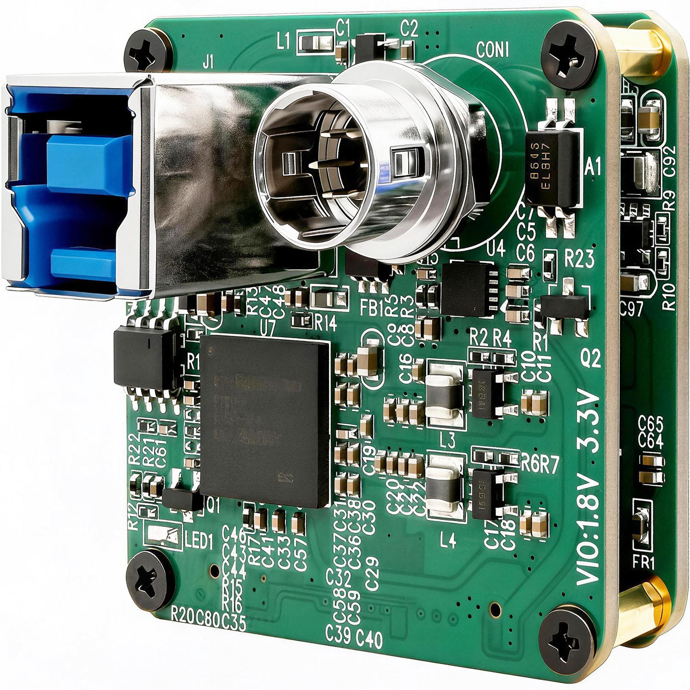

---

## Table of Contents

1. [Product Overview](#1-product-overview)
2. [eBus Player Node Map & GenICam Parameters](#2-ebus-player-node-map--genicam-parameters)
3. [Trigger & Strobe Timing](#3-trigger--strobe-timing)
4. [Hardware](#4-hardware)
5. [Pleora eBus Player](#5-pleora-ebus-player)
6. [Key Function Operation Guide](#6-key-function-operation-guide)
7. [Aravis](#7-aravis)
8. [Packing List](#8-packing-list)
9. [Download](#9-download)

---

## 1. Product Overview

The U3V-CAM-IMX296 is a high-performance USB3 Vision industrial camera featuring the Sony IMX296LLR (monochrome) global shutter CMOS sensor. With a resolution of 1.58 MP (1456 × 1088) and a full-resolution frame rate of 60 fps in MONO8 mode, it delivers reliable, distortion-free imaging for demanding machine-vision applications such as motion analysis, automation, robotics, and scientific imaging.

The camera implements the USB3 Vision protocol completely and without compromise, offering every standard feature (arbitrary ROI, analog gain, long exposure, opto-isolated I/O, high-precision timestamp, etc.) through standard GenICam nodes — truly plug-and-play across all major software platforms.

Equipped with a true global shutter sensor and full GenICam trigger control, it supports opto-isolated Hardware Trigger (5–24 V) and Software Trigger with `TriggerSource = Software`. The opto-isolated Strobe output, plus 0.1 µs hardware timestamping ensure precise exposure and lighting synchronization, making the camera ideal for motion-triggered inspection, robotic pick-and-place, area-scan emulation, and any application requiring deterministic timing.

### 1.1 Key Features

- Sony IMX296 1/2.9" global shutter CMOS sensor (diagonal 6.3 mm)
- Resolution: 1456 × 1088 pixels (1.58 MP), pixel size 3.45 µm × 3.45 µm
- Full-resolution 1468×1088 MONO8 @ 60 fps (real sustained USB 3.0 bandwidth)
- Arbitrary ROI (single regions) — frame rate increases inversely with active rows, exceeding 1900 fps in typical reduced-height ROIs
- True analog gain value 0–48 dB (GainRaw 0–480), 0.1 dB step (GainRaw 1)
- Manual shutter with true long-exposure capability (≥ 16 seconds)
- Hardware & software trigger modes (opto-isolated input)
- Opto-isolated strobe output
- High-precision hardware timestamp (0.1 µs = 100 ns resolution)
- On-board temperature sensor with real-time readout
- "Find Me" LED for instant multi-camera identification
- Device reset via GenICam command
- Globally unique 64-bit serial number (factory-burned)
- 100% compliant with USB3 Vision v1.0 and GenICam 3.x
- Plug-and-play with OpenSource Aravis, eBus Universal Pro (Free License Version)

### 1.2 Specifications

#### Sensor & Imaging

| Parameter | Value |
|-----------|-------|
| Sensor | Sony IMX296LLR (Monochrome, Global Shutter, Pregius Gen2) |
| Resolution | 1456 (H) × 1088 (V) — 1.58 MP |
| Pixel Size | 3.45 µm × 3.45 µm |
| Optical Format | 1/2.9" (diagonal 6.3 mm) |
| Max Frame Rate (Full ROI) | 60 fps @ Mono8 |
| Frame Rate (Reduced ROI) | Inversely proportional to active rows; typically 1900+ fps |
| Pixel Formats | Mono8 (native), Mono10 (firmware upgradeable) |
| Exposure Time | 29 µs – ≥15 seconds (true long exposure); Long Exposure Mode ≥ 16504 µs |
| Analog Gain | 0–48 dB (0.1 dB steps, true analog) |
| Dynamic Range / SNR | ~71 dB / ~40 dB |
| Shutter Type | Global Shutter (zero rolling distortion) |

#### USB3 Vision / GenICam Standard Features

| Parameter | Value |
|-----------|-------|
| Protocol Compliance | 100% USB3 Vision v1.0 + GenICam 3.x |
| Streaming Protocol | U3VSP (leader/payload/trailer, packet resend, auto packet-size negotiation) |
| Arbitrary ROI | Width, Height, OffsetX/Y, ReverseX/Y |
| Acquisition Control | TriggerMode (On/Off), TriggerSoftware, TriggerSource (Software / Line1) |
| Analog & Digital Control | GainSelector (All), GainRaw (0–480) |
| Device Control | DeviceTemperature (±0.1 °C), DeviceReset, Unique 64-bit Serial Number, Find-Me LED |

#### Electrical & I/O

| Parameter | Value |
|-----------|-------|
| Power Supply | USB 3.0 bus-powered, 5 V / ≤ 3.2 W |
| Trigger Input (Line 1) | Opto-isolated, 5–24 V, rising/falling edge |
| Strobe Output | Opto-isolated open-collector, max 100 mA, programmable polarity/delay/duration (0.1 µs step) |
| Hardware Timestamp | 0.1 µs (100 ns) resolution, FPGA-based 10 MHz counter |

#### Mechanical & Environmental

| Parameter | Value |
|-----------|-------|
| Weight | ≤ 45 g |
| Lens Mount | M12 Lens YT10068-2mp / C-Mount (CS-Mount adapter only) |
| Operating Temperature | –10 °C to +65 °C |
| Storage Temperature | –30 °C to +80 °C |
| Humidity | 20–80% RH (non-condensing) |

#### Software & Compatibility

| Parameter | Value |
|-----------|-------|
| SDK | Pleora eBus Universal (Windows & Linux); Aravis 0.8.35 (Linux) |
| GenICam Interface | 100% standard XML, zero proprietary nodes |
| Supported OS | Windows 10/11, Linux (Ubuntu 20.04/22.04+), ARM64 (NVIDIA Jetson validated), Raspberry Pi, etc. |

---

## 2. eBus Player Node Map & GenICam Parameters

Connect the camera in eBus Player → Select the device → Click **Guru** mode → Expand **GenICam** tree.

All parameters below are 100% standard GenICam SFNC nodes — the camera embeds a complete XML description file that eBus Player loads automatically from the device (no local XML file needed).

| No. | Key Parameters | eBus Player Path (Guru Mode) | Exact GenICam Node(s) | Access | Range / Values | Notes |
|-----|---------------|-----------------------------|-----------------------|--------|----------------|-------|
| 1 | Arbitrary ROI — FPS increases with fewer rows | ImageFormatControl → Region Selector | Width, Height, OffsetX, OffsetY, ReverseX, ReverseY | RW | Width: 80–1456 (step 4); Height: 4–1088 (step 4) | — |
| 2 | True Analog Gain 0–48 dB (GainRaw 0–480) | AnalogControl → Gain Selector | GainRaw | RW | 0–48 dB, step 0.1 dB (GainRaw 0–480) | Real analog gain, extremely low noise |
| 3 | Manual shutter + true long exposure | AcquisitionControl | ExposureMode = Timed; ExposureTime | RW | 29 µs – ≥15.534 s; Long Exposure ≥ 16504 µs | Scientific & low-light imaging |
| 4 | Real-time temperature measurement | DeviceControl → Device Temperature Selector | DeviceTemperature | RO | ±0.1 °C accuracy | — |
| 5 | "Find Me" LED | DeviceControl | Find Me | RW | Blink | Instantly locate camera in multi-cam rack |
| 6 | Remote Device Reset | DeviceControl | DeviceReset | Exec | Execute | One-click reboot without unplugging |
| 7 | Free Running | Default | Default | Exec | Power On | Plug and Play |
| 8 | Hardware Trigger (opto-isolated) | AcquisitionControl → Trigger Mode / Trigger Source / Trigger Activation | TriggerMode = On; TriggerSource = Line1; TriggerActivation = (FallingEdge / RisingEdge) | RW | Line1: 5–24 V opto-isolated | Highest triggered frame rate |
| 9 | Software Trigger | AcquisitionControl → Trigger Mode / Trigger Source / Trigger Software | TriggerMode = On; TriggerSource = Software; TriggerSoftware = Software | RW | — | Highest triggered frame rate |
| 10 | Opto-isolated Strobe output | AcquisitionControl → TriggerMode | Off (Sensor Output Strobe Signal); On (FPGA) | RW | N/A | Perfect flash synchronization |
| 11 | Always-on 0.1 µs hardware timestamp | DeviceControl → Device Timestamp Latch | Device Timestamp Latch | RW/RO | 0.1 µs resolution (10 MHz counter) | Identify data timestamp |
| 12 | Globally unique serial number | DeviceControl → Device Serial Number | DeviceSerialNumber | RO | Factory-burned ID | Asset management & anti-counterfeiting |
| 13 | Native MONO8 output | ImageFormatControl → Pixel Format | PixelFormat | RW | Mono8 (default) | Only ~760 Mbps at full resolution 1456×1088 |
| 14 | 100% USB3 Vision | Root → All categories | — | — | — | Works with any GenICam software without patches |

---

## 3. Trigger & Strobe Timing

### 3.1 Trigger Signal on IMX296

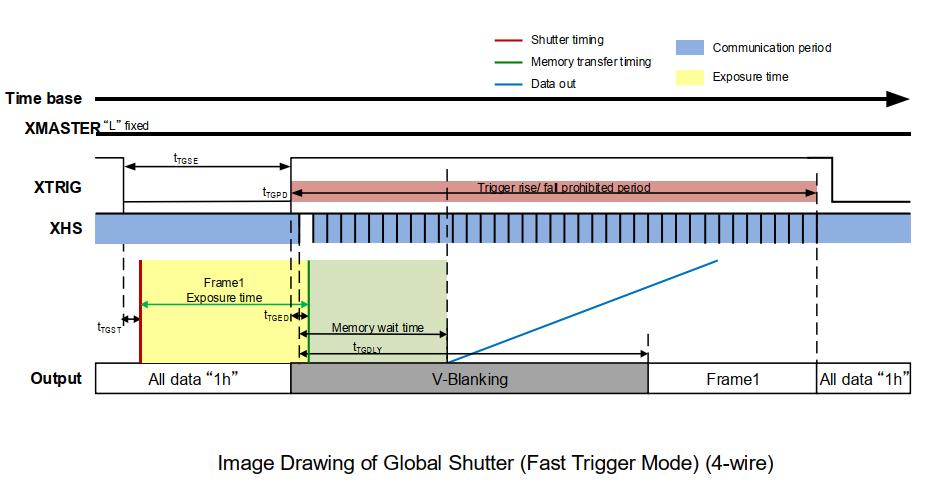

**Parameter List of Global Shutter (Fast Trigger Mode):**

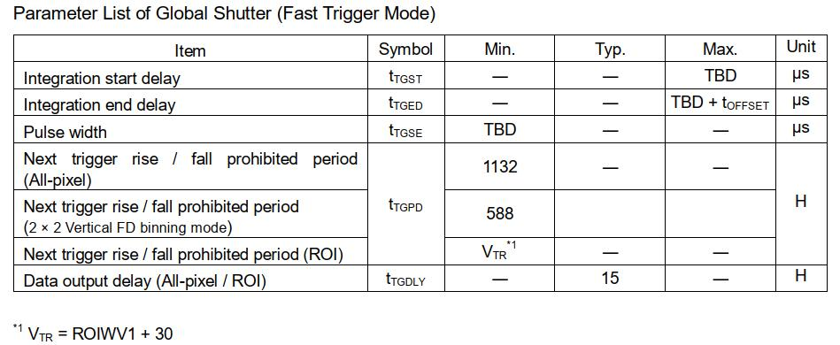

> **tH ≥ 14.815 µs** (minimum trigger pulse width)

### 3.2 ROI WV1: ROI Output Height

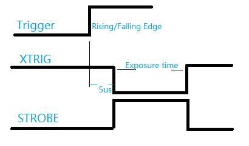

### 3.3 Trigger and STROBE Signals on Device Connector

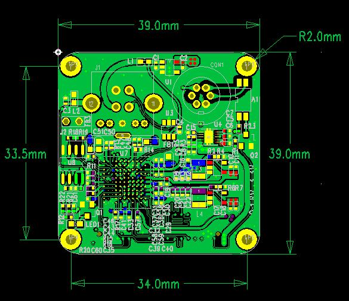

---

## 4. Hardware

### 4.1 Size Information

#### 4.1.1 2D Drawing

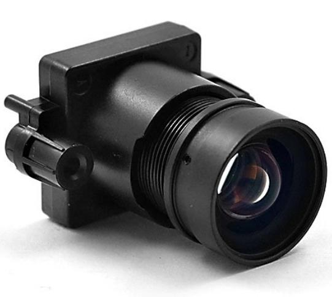

#### 4.1.2 Mechanical Drawings

TBD

### 4.2 Lens

#### 4.2.1 M12 Lens (Default)

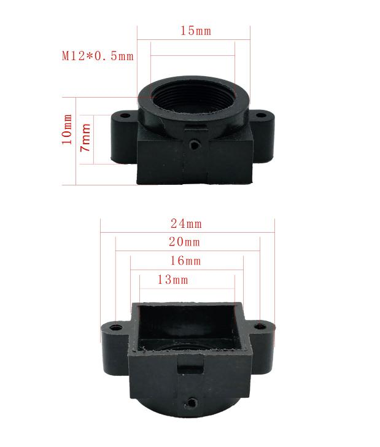

**M12 Lens Part Number:** YT10068-2mp 6MM, No IR Filter

**M12 Lens Datasheet:**

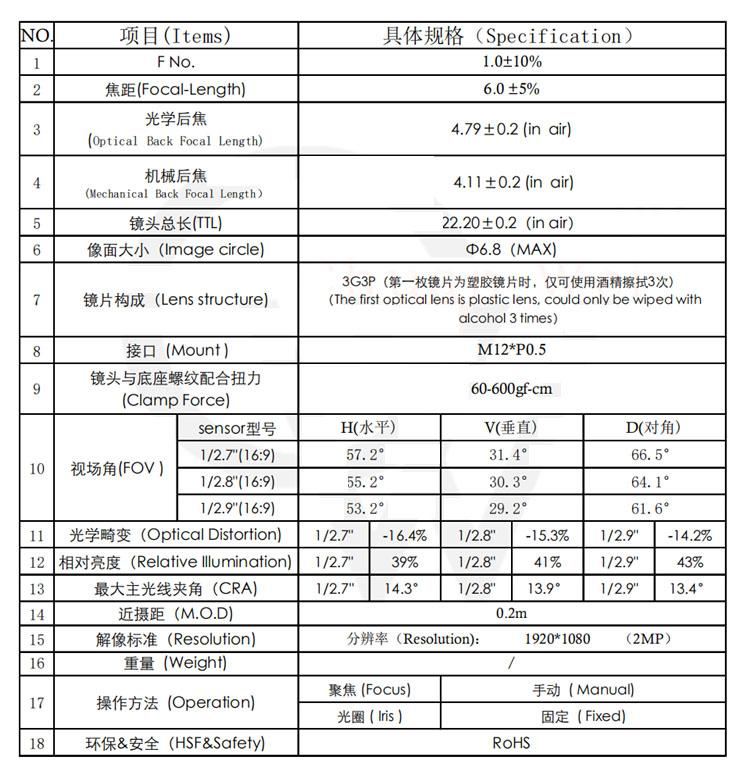

#### 4.2.2 CS Lens (Optional)

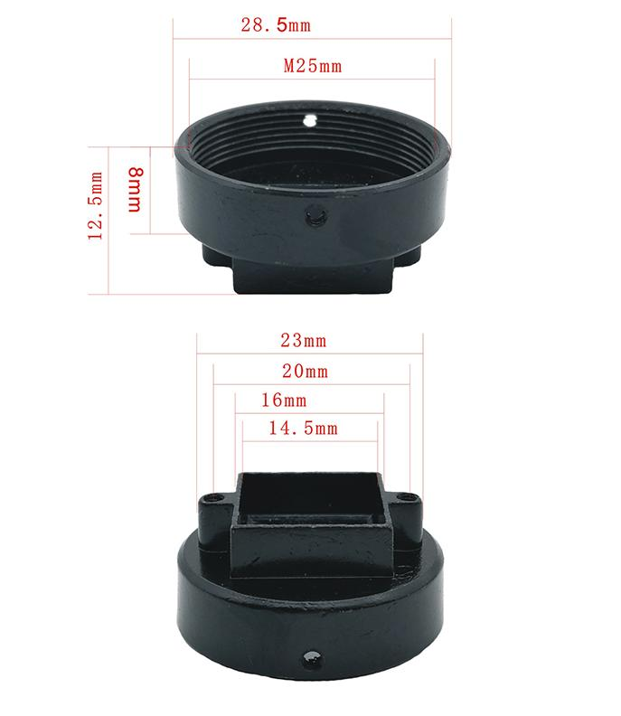

**CS Lens Part Number:** FA1614/10MP/C

**CS Lens Datasheet:**

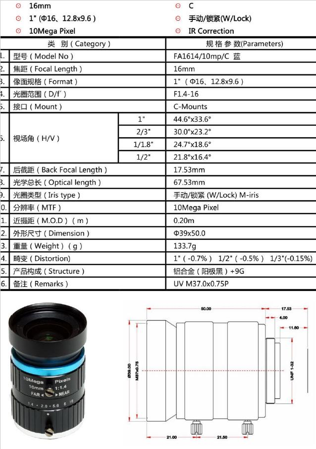

### 4.3 I/O Connector Pinout

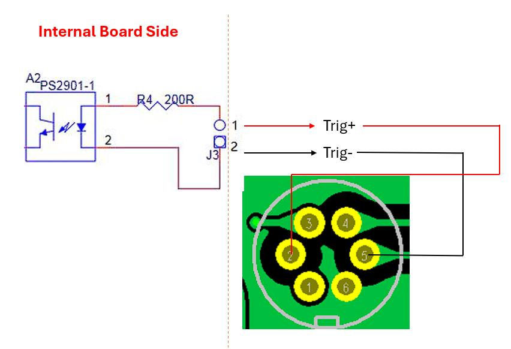

#### 4.3.1 USB3.0 Connector

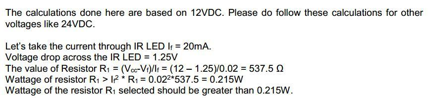

**Part Number:** HC-ST-030-10B-L-Z-30-R

#### 4.3.2 Trigger/Strobe/IO Connector

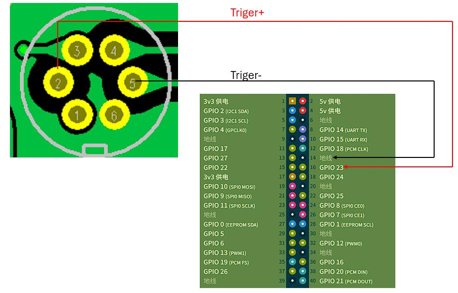

**Onboard Connector Part Number:** HR10A-7R-6P / HR10A-7R-6PB(73) / HR10A-7R-6P(73)

| PIN | Signal |
|-----|--------|
| PIN1 | GPIO_B33, Reserve |
| PIN2 | Trig + |
| PIN3 | GPIO_A33, Reserve |
| PIN4 | STROBE+ |
| PIN5 | STROBE– / GND_ISO / Trig– GND |
| PIN6 | GND |

#### 4.3.3 Trigger/Strobe/IO Cable

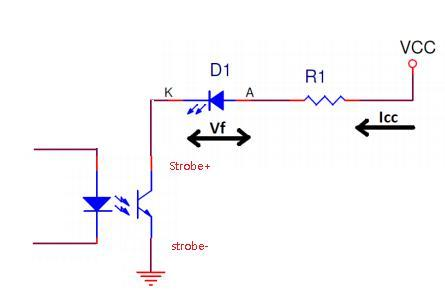

**Cable Part Number:** 6-pin Hirose Connector Power & Trigger Cable, 1M  
**Connector:** HR10A-7P-6S

| Wire Color | Signal | PIN |
|-----------|--------|-----|
| White/Brown | Trigger + | PIN2 |
| Blue | STROBE+ | PIN4 |
| Yellow | STROBE– / Trigger– / GND_ISO | PIN5 |

#### 4.3.4 LED Indicators

| Color / State | Meaning |
|--------------|---------|
| Green (solid) | Power On |
| Flashing | Find Me |

### 4.4 Trigger IN Circuit Diagrams

#### 4.4.1 Trigger Circuit On Board (Internal)

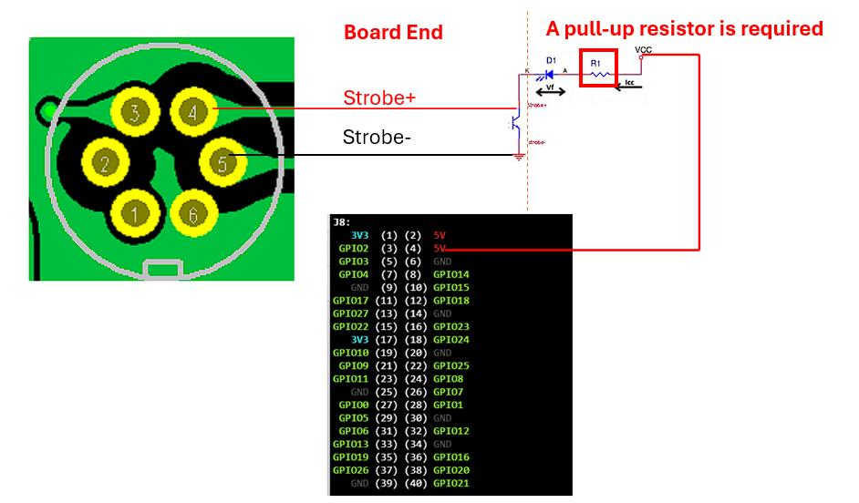

For example, VCC = 12 V, Vf = 1.25 V

There is a resistor on board (R4 = 200 Ω), so:

```
R_add = R1 – R4 = 537.5 – 200 = 337.5 Ω
```

#### 4.4.2 Trigger Circuit with Raspberry Pi 5 (External Wiring)

We use Raspberry Pi 5 GPIO23/GND and a script to generate the trigger signal.

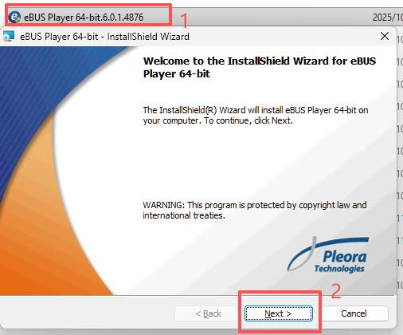

Save the following script to a `.sh` file:

```bash
while true; do
    gpioset gpiochip0 23=1
    sleep 1.9999
    gpioset gpiochip0 23=0
    sleep 0.0033
done
```

Open another terminal window to run the script.

### 4.5 Strobe Out Circuit Diagrams

#### 4.5.1 Reference Outlet Circuit

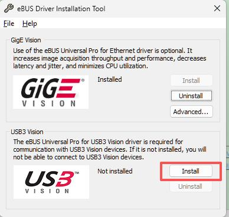

#### 4.5.2 Connection with Raspberry Pi 5

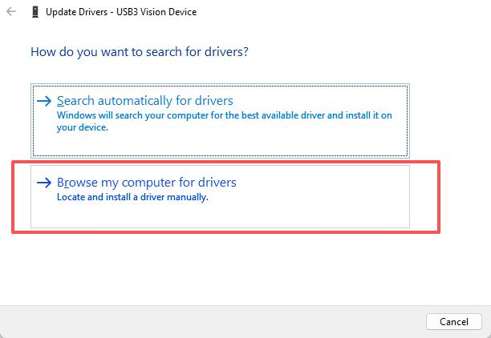

---

## 5. Pleora eBus Player

### 5.1 Installation Guide on Windows

#### 5.1.1 Install eBus Player

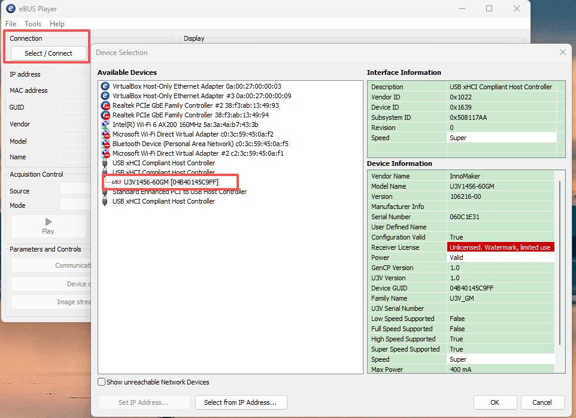

#### 5.1.2 Install Drivers

Find the eBus Driver Installation Tool from your application.

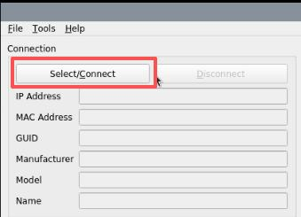

Click **Install** after the following window appears:

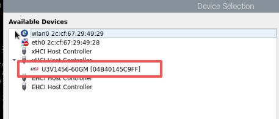

After the driver installs successfully, you can find the USB3 Vision device in Device Manager.

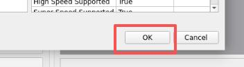

> **Note:** If you still cannot find the USB3 Vision device in Device Manager, follow the steps below to install the driver manually.

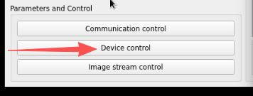

The path depends on the folder where you installed your software:

```
C:\Program Files\Common Files\Pleora\eBUS SDK
```

or

```
XX:\XX\Common Files\Pleora\eBUS SDK
```

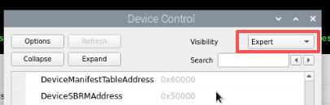

#### 5.1.3 Launch eBus Player

Double-click **eBus Player** on your desktop.

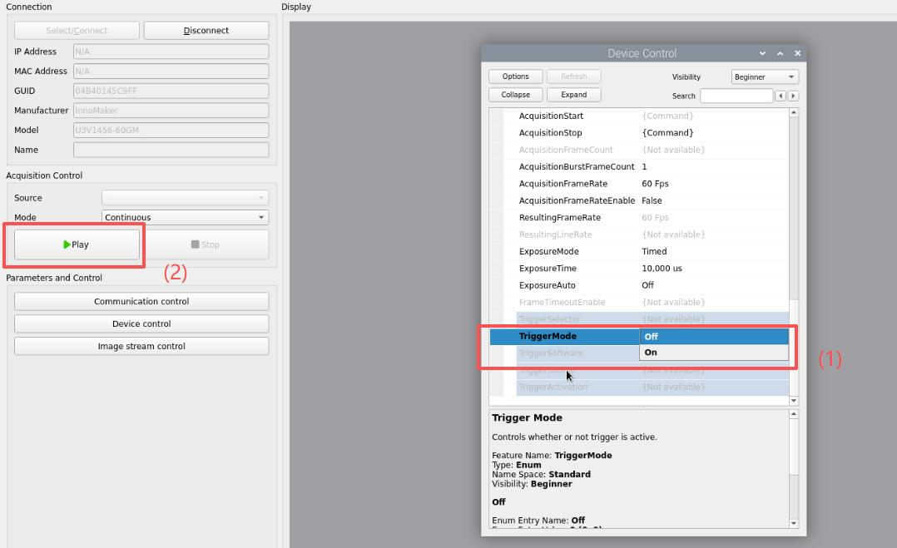

### 5.2 Installation Guide on Linux

Tested with Raspberry Pi 5 OS (Debian Bookworm).

#### 5.2.1 Install eBus Player

Download the source from our GitHub, then run:

```bash
cd U3V-CAM-IMX296
sudo chmod -R a+rwx *
cd ebus_sdk_raspberry_pi/
sudo dpkg -i eBUS_SDK_JAI_Raspberry_Pi4_Pi5_linux-aarch64-arm-6.5.3-7155.deb
```

#### 5.2.2 Install Qt Libraries

After the eBus SDK installs, install the required Qt libraries:

```bash
sudo apt-get update
sudo apt-get install libqt5opengl5
```

> **Remark:** If you are running Trixie OS:
>
> ```bash
> echo "deb http://deb.debian.org/debian bookworm main" | sudo tee /etc/apt/sources.list.d/bookworm.list
> sudo apt update
> sudo apt install -t bookworm libavcodec59 libavformat59 libavutil57 libswscale6 libswresample4
> ```
>
> After installation, clean up:
>
> ```bash
> sudo rm /etc/apt/sources.list.d/bookworm.list
> sudo apt update
> ```

#### 5.2.3 Launch eBus Player

```bash
cd /opt/jai/ebus_sdk/linux-aarch64-arm/bin
sudo ./eBUSPlayerJAI
```

### 5.3 Open U3V-IMX296-GS via eBus Player

The following steps apply to both Linux and Windows.

#### 5.3.1 Select Device

Plug the USB cable into the computer and launch eBus Player.

Click **Select/Connect**, choose `U3V1456-60GM[04B40145C9FF]`, then click **OK**.

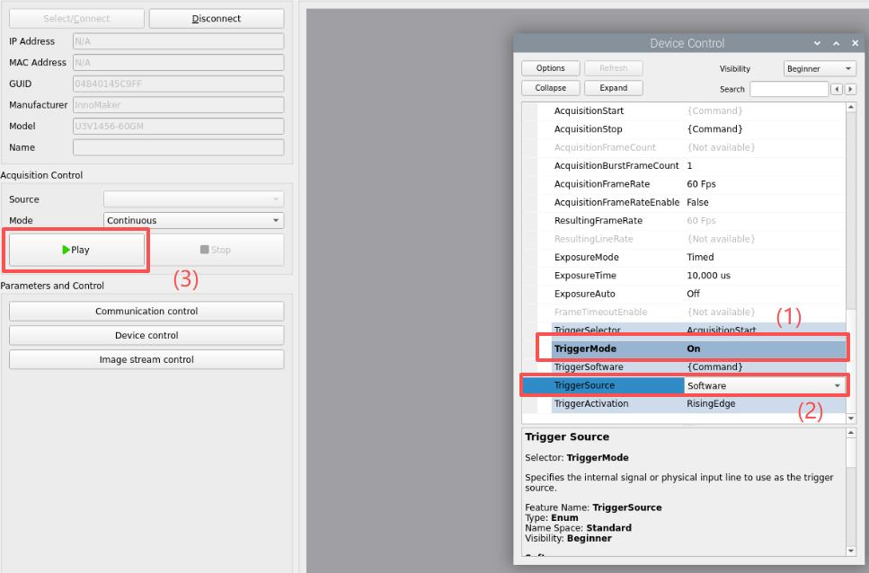

#### 5.3.2 Set Mode

Click **Device Control**, choose **Guru** from Visibility.

**DEVICE Control → Guru**

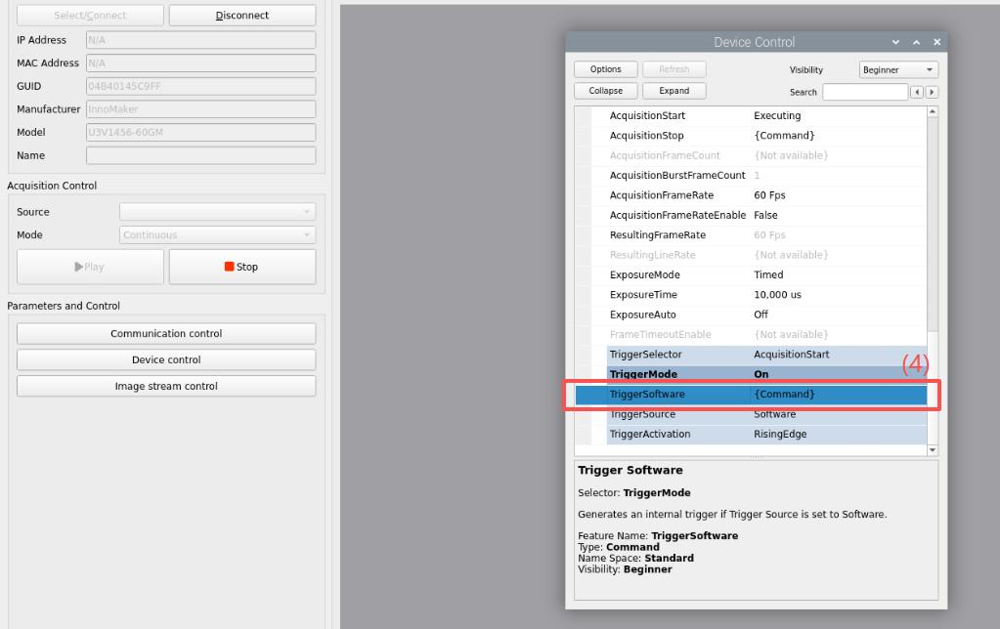

---

## 6. Key Function Operation Guide

### 6.1 Free Running Mode

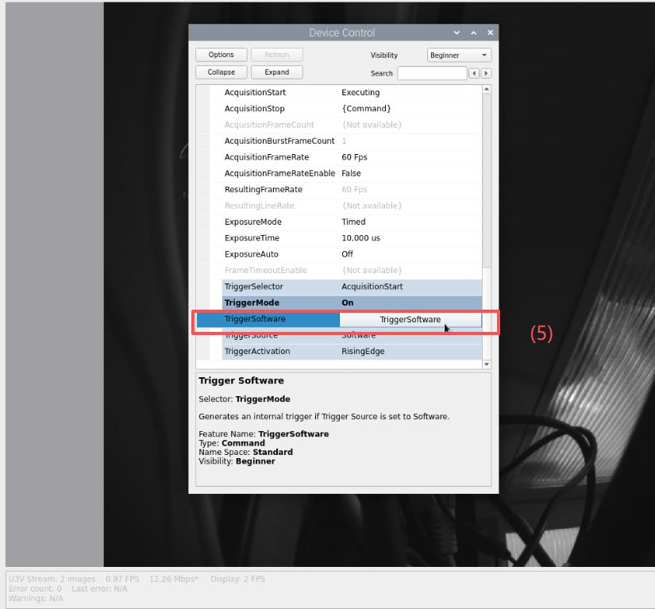

1. Set **TriggerMode** to **Off**
2. Click **Play**

### 6.2 Software Trigger

#### 6.2.1 Circuit Routing

Follow Chapter 4.4 & 4.5 for circuit routing.

#### 6.2.2 eBus Player Operation

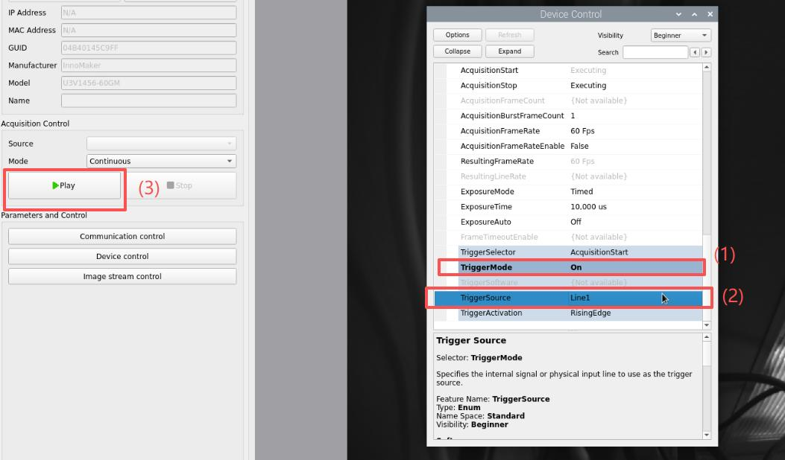

1. **TriggerMode:** On
2. **TriggerSource:** Software
3. Click **Play**
4. Double-click **{Command}**

#### 6.2.3 Start Software Trigger

Click the **TriggerSoftware** button.

#### 6.2.4 FallingEdge / RisingEdge

You can also select **FallingEdge** or **RisingEdge** from **Trigger Activation**.

Refer to [Chapter 3](#3-trigger--strobe-timing) for details.

### 6.3 Hardware Trigger

#### 6.3.1 Circuit Routing

Follow Chapter 4.4 & 4.5 for circuit routing.

#### 6.3.2 eBus Player Operation

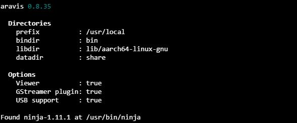

1. **Trigger Mode:** On
2. **TriggerSource:** Line1
3. Click **Play**

#### 6.3.3 Run Hardware Trigger Source

We use Raspberry Pi 5 GPIO23 / GPIO25 to generate the source signal with a simple script:

```bash
pi@raspberrypi:~ $ cd U3V-CAM-IMX296/
pi@raspberrypi:~ $ sudo ./imx296.sh
```

Script content (save as `imx296.sh`):

```bash
while true; do
    gpioset gpiochip0 23=1
    sleep 1.9999
    gpioset gpiochip0 23=0
    sleep 0.0033
done
```

#### 6.3.4 FallingEdge / RisingEdge

You can also select **FallingEdge** or **RisingEdge** from **Trigger Activation**.

Refer to [Chapter 3](#3-trigger--strobe-timing) for details.

---

## 7. Aravis

### 7.1 About Aravis

Aravis is an open-source software library for industrial vision cameras. It is widely used in robotics, industrial automation, scientific imaging, and research because of its reliability, speed, and excellent GenICam compliance.

Aravis is a lightweight, open-source vision library built on GLib/GObject, designed for high-performance video streaming from GenICam-compliant industrial cameras. It runs on Linux, macOS, and Windows.

| Category | Key Features |
|----------|-------------|
| Core Functionality | Implements GenICam standard for camera discovery, control, and image acquisition. Supports GigE Vision and USB3 Vision cameras. Works with many major brands (Basler, Allied Vision, FLIR, JAI, The Imaging Source, Dalsa, Smartek, etc.). |
| Protocol Support | Full GigE Vision 1.x and 2.x support (including GVSP packet resend and leader/trailer). USB3 Vision support. Multiple cameras can stream simultaneously on the same host. |
| Tools & Viewers | **arv-viewer**: GTK-based viewer with live display, histogram, ROI control, register inspection, and GenICam feature tree. **arv-fake-camera**: GigE Vision camera emulator for testing without real hardware. Command-line tools: `arv-tool`, `arv-register-viewer`, etc. |
| Integration | GStreamer plugin (`aravissrc`) for easy integration into multimedia pipelines (OpenCV, ROS, etc.). ROS 1 and ROS 2 drivers available (`camera_aravis` package). Python bindings via GObject introspection. |
| Performance | Zero-copy buffer handling when possible. Highly optimized for low latency and high frame rates. Supports jumbo frames, packet size tuning, and real-time kernel optimizations. |
| Build & Dependencies | Minimal dependencies: glib2, libxml2, zlib. Optional: libusb-1.0 (USB3 Vision), GTK4 (viewer), GStreamer, libnotify, etc. Can be compiled with Meson or CMake. |
| License & Community | Licensed under LGPL v2.1+, allowing use in both open-source and proprietary projects. Active community; contributions (code, bug reports, camera donations) are welcome. |

**Official repository:** https://github.com/AravisProject/aravis

### 7.2 Aravis Install Guide

You can refer to the link below for the latest version. We use aravis-0.8.35 on Raspberry Pi 5 for our demo.

https://aravisproject.github.io/aravis/aravis-stable/building.html#installing-aravis

#### 7.2.1 Download Source Code

Download from our GitHub and extract:

```bash
cd U3V-IMX296-GS
sudo tar -xf aravis-0.8.35.tar.xz
cd aravis-0.8.35
sudo chmod -R a+rwx *
```

Install dependencies before building (Raspberry Pi Trixie OS):

```bash
sudo apt install libxml2-dev
sudo apt install libglib2.0-dev
sudo apt install gettext
sudo apt install gobject-introspection libgirepository1.0-dev \
    libgtk-3-dev \
    libgstreamer1.0-dev libgstreamer-plugins-base1.0-dev
```

Build and install:

```bash
sudo meson setup build
cd build
sudo ninja
sudo ninja install
```

> **Note:** If you see errors during `meson setup build`:
>
> **(1)** The build can be configured at any time using `meson configure` in the build directory. On some platforms (like Ubuntu), you may need to configure the dynamic linker (ld):
>
> ```bash
> sudo ldconfig
> ```
>
> Install dependencies on Ubuntu 20.04:
>
> ```bash
> sudo apt install libxml2-dev libglib2.0-dev cmake libusb-1.0-0-dev gobject-introspection \
>     libgtk-3-dev gtk-doc-tools xsltproc libgstreamer1.0-dev \
>     libgstreamer-plugins-base1.0-dev libgstreamer-plugins-good1.0-dev \
>     libgirepository1.0-dev gettext
> ```
>
> **(2)** To reconfigure the build, check and install missing libraries, then re-run:
>
> ```bash
> sudo meson setup --reconfigure build
> sudo meson setup --wipe build
> ```

### 7.3 Launch Aravis

After installation:

```bash
cd ~/aravis-0.8.35/build/viewer/
sudo ./arv-viewer-0.8
```

### 7.4 Aravis Key Parameters

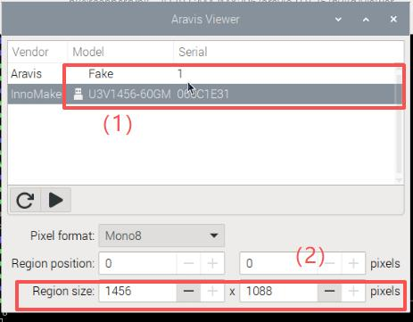

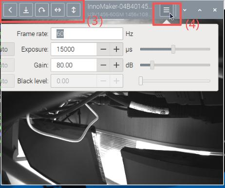

1. Device Information
2. Region Size / Resolution
3. Save snapshot
4. Rotate Image to the Right
5. Flip Image Horizontally
6. Flip Image Vertically
7. Frame Rate, Exposure, Gain

---

## 8. Packing List

- 1× U3V-CAM-IMX296 with M12 Lens installed
- 1× CS Lens Mount
- 1× USB3.0 Type B Cable (1 metre)
- 1× 6-pin Hirose Connector Power & Trigger Cable

---

## 9. Download

https://github.com/INNO-MAKER/u3v-cam-imx296

### 9.1 Software

- eBus Player Windows SDK
- eBus Player Linux SDK
- Open-source Aravis Linux SDK
- User Manual
- Pre-installed Raspberry Pi OS System Image (with eBus Player and Aravis pre-installed)

---

> www.inno-maker.com | www.github.com/inno-maker
> sales@inno-maker.com | support@inno-maker.com
